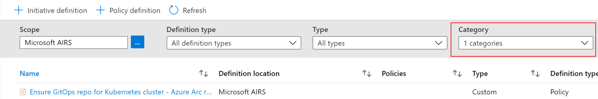
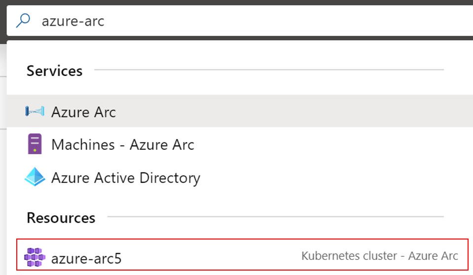
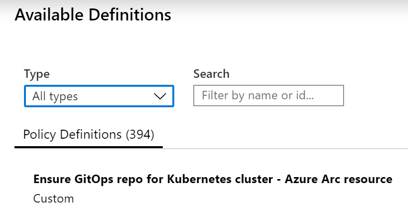
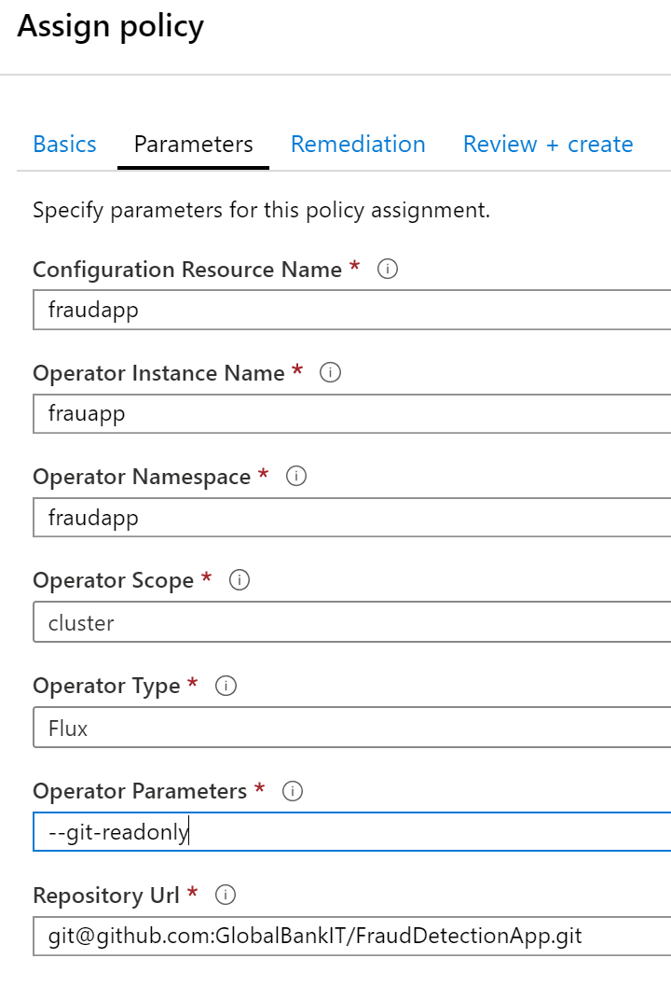
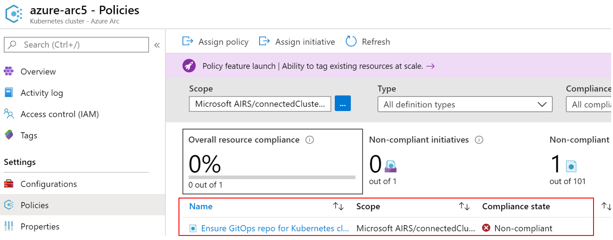
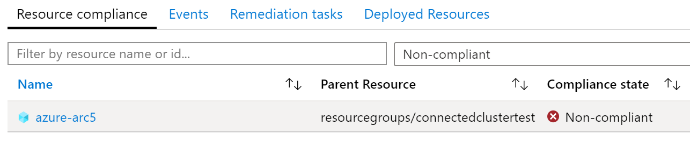
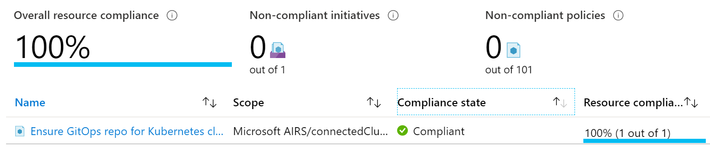

# Lab 2 - Assign a custom policy to Kubernetes

## Create a new custom policy definition

* Goto portal.azure.com
* Search for "Policy"
* Click on "Services" > "Policy"

You are now in the Azure Policy Panel of your Azure Portal.

* Click "Definitions" (in the Authoring section)
* Click "+ Policy Definition"
* Select a "Definition location"

You can select your Azure Subscription here.

* Click "Select"
* Specify a name e.g. "Ensure GitOps repo for Kubernetes cluster - Azure Arc resource"
* Specify a category, select "Create new" and type in "AzureArc"
* Paste the policy example into the "Policy Rule" textbox
* Click "Save"

You have now created a new custome policy definition. You can filter the list of policy definitions by "Category" (as specified above)



## Apply the custom policy definition

* Goto portal.azure.com
* Search for our Azure Arc Kubernetes Cluster



* Select your Arc managed cluster
* Click "Settings" > "Policies"
* Click "-> Assign policy"
* Leave the "Scope" as it is
* Select "Policy definition"



* Click on "Parameters"
* Specify a few needed parameters



* Click "Next"
* Check "Create a remediation task"
* Select "Policy to remediate"
* Click "Review + Create"
* Click "Create"

This will now apply the policy to your Kubernetes cluster. 

## Monitor Policies

The next steps will take a while. After a few minutes the Policy should show its "Compliance state" and a few minutes later the remediation task (we have specified above) will take care of deploying the missing pieces.

* Go back to your Arc-managed Cluster
* Click "Settings" > "Policies"

In this dialog you are already able to see the current "Compliance state" of your policy assignment:



* Click on your custom policy assignment



In the background our remediation task is already about to deploy the missing pieces to make sure that our cluster is "compliant". You can go to your `kubectl` to check if the "fraudapp" was already deployed.

```bash
kubectl get pods --all-namespaces
```

Our policy assignment will create a new namespace and a new deployment:

```console
NAMESPACE     NAME                                  READY   STATUS    RESTARTS   AGE
fraudapp      frauapp-889577d9f-7c8fm               1/1     Running   0          91s
fraudapp      memcached-7974cb8d5b-gjfnl            1/1     Running   0          91s
...           ...                                   ...     ...       ...        ...
```

A few minutes later, after successfully deploying the demo application and the next refresh our policy assignment should now show up as "Compliant".

